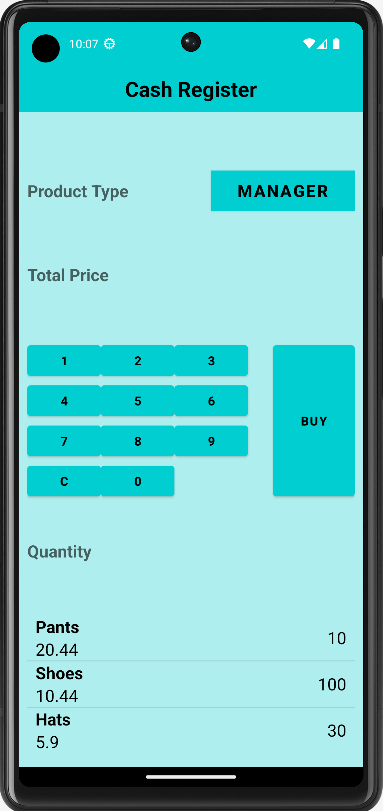
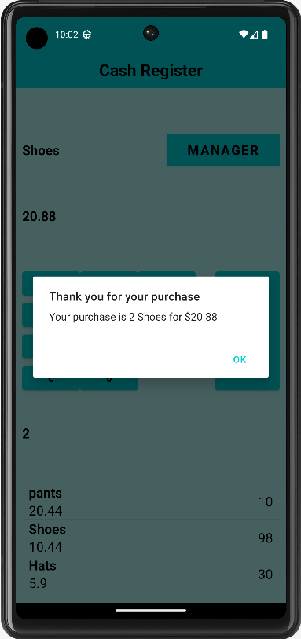
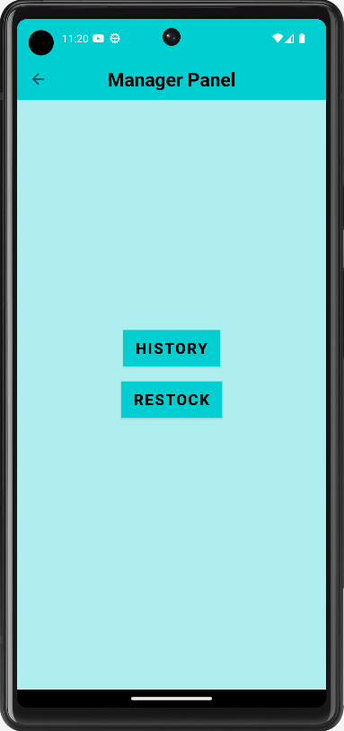
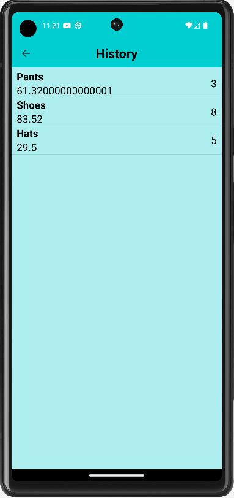
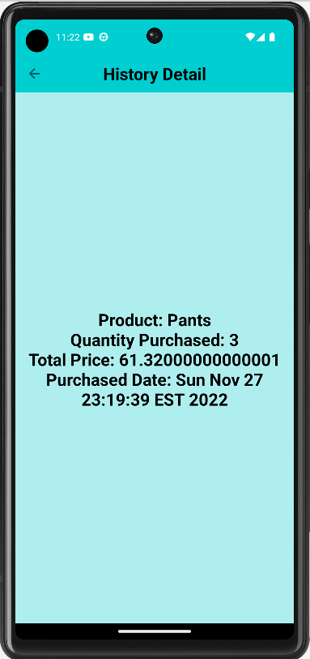
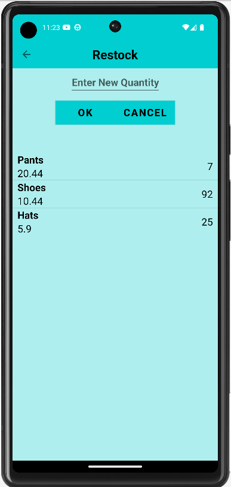
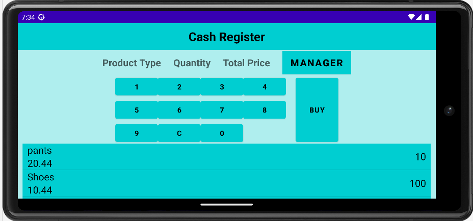

# Cash Register Demo Android App using Java
- Supports both Landscape and Portrait Orientation
- Demonstrates multiple page navigation and passing data between activities using intent
- Custom Application class is being used to manage application data about products
- Cash Register activity is used to enter details of the products being purchased. There is a Product List that displays all the products available for purchase. The total price is automatically calculated based on the product selected from the list, quantity entered and its price when buy button is clicked. The purchase details will be added to the history after the purchase is made. List View and Base Adapter is used to display Product List in this Activity.This activity also handles incorrect user input and displays a toast (pop up) if selected quantity of a product is more than its available quantity in stock, or if a buy button is clicked without selecting the product or quantity
- The Manager Panel Activity has options to see the history of all the purchased products and restock the quantity of products. 
- In the History Activity, Recycler View and Recycler Adapter is being used to display data in History list. When a product is selected from the History list, the app navigates to History Detail activity with more details about that purchase 
- In the Restock activity, quantity of a product can be updated when OK button is clicked. A toast with an error message pops up if Ok button is clicked without selecting an item from the list or entering a quantity. If Cancel button is clicked, the app will navigate back to the Manager Panel Activity
- The updated Product List will be seen when returned to Cash Register Activity

